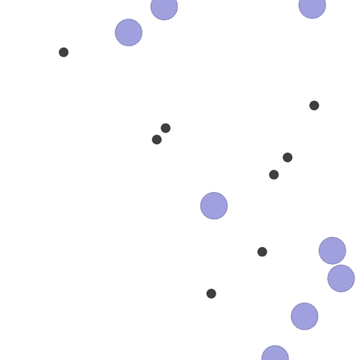

<div align="center">
    <h1>A Study of Partial Observability in <br/> Multi-Agent Reinforcement Learning</h1>
    <a href="https://github.com/TIERS/partially-observable-marl/blob/main/LICENSE"></a>
    <a href="https://github.com/TIERS/partially-observable-marl/blob/main"></a>
    <a href="https://github.com/TIERS/partially-observable-marl/blob/main"></a>
    <a href="https://github.com/TIERS/partially-observable-marl/blob/main"></a>
    <br />
    <br />
    <a href="#">Paper</a>
    <span>&nbsp;&nbsp;•&nbsp;&nbsp;</span>
    <a href="https://github.com/TIERS/partially-observable-marl/issues">Contact Us</a>
  <br />
  <br />
  <p align="center">
    <!--  -->
  <div class="container">
    
    <!-- <figcaption>2 agents.</figcaption> -->
    
    <!-- <figcaption>4 agents.</figcaption> -->
    
    <!-- <figcaption>6 agents.</figcaption> -->
    
    <figcaption>Simple-Spread task: Agents with different partial observation settings can achieve comparable performance with near-optimality. From left to right: agents can observe nearby 2, 4, 6, 8 agents.</figcaption>
  </div>

  </p>

</div>

<!-- <div class="row">
  <div class="column">
    
    <figcaption>obs=2.</figcaption>
  </div>
  <div class="column">
    
    <figcaption>obs=4.</figcaption>
  </div>
  <div class="column">
    
  </div>
  </div> -->

## Installation

```bash
$ conda env create -f environment.yml
```

## Train the agents

```bash
$ cd scripts
$ ./run_mpe_batch.sh
```

## Results

The pretrained simple-spread models can be found in `results/MPE/simple_spread/ramppo/models`
```bash
$ cd scripts
$ ./render_mpe.sh
```
## Citation

If you use this dataset for any academic work, please cite the following publication:

```
@misc{wenshuai2023less,
    title={Less Is More: Robust Robot Learning via Partially Observable Multi-Agent Reinforcement Learning}, 
    author={Wenshuai Zhao and Eetu Rantala and Joni Pajarinen and Jorge Peña Queralta},
    year={2023},
    eprint={},
    archivePrefix={arXiv},
    primaryClass={cs.RO}
}
```
